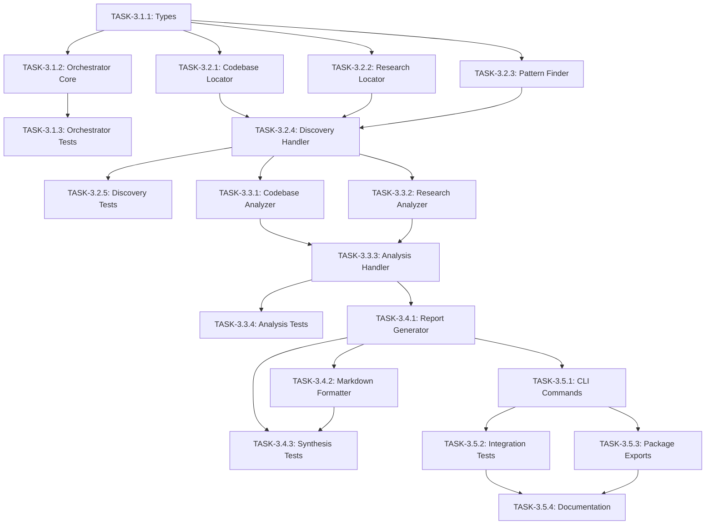

# Phase 3 Implementation Plan: Research Orchestration

**Plan ID**: PHASE-3-RESEARCH  
**Title**: Research Orchestration System  
**Duration**: 2 weeks (Weeks 5-6)  
**Status**: Planning  
**Created**: 2025-01-05  
**Target Release**: v0.3.0-rc1  

---

## Overview

Phase 3 implements the research orchestration system that coordinates multiple agents through a 3-phase research process: parallel discovery, sequential analysis, and synthesis. This builds on the agent coordination infrastructure completed in Phase 2.

### Goals
1. Build the research orchestrator for multi-phase research workflows
2. Implement parallel discovery with 3 specialized discovery agents
3. Create sequential analysis pipeline with intelligent synthesis
4. Generate comprehensive research reports with evidence references

### Success Criteria
- [ ] Research orchestrator executes 3-phase workflow end-to-end
- [ ] Parallel discovery runs 3 agents concurrently (codebase-locator, research-locator, pattern-finder)
- [ ] Sequential analysis processes discovery findings correctly
- [ ] Research reports include file:line evidence references
- [ ] 80%+ test coverage for new components
- [ ] Integration with existing agent coordinator

---

## File Structure

```
src/
├── research/
│   ├── types.ts              # Research-specific type definitions
│   ├── orchestrator.ts       # Main research orchestration engine
│   ├── discovery.ts          # Parallel discovery phase handler
│   ├── analysis.ts           # Sequential analysis phase handler
│   └── synthesis.ts          # Report synthesis and formatting

tests/
├── research/
│   ├── types.test.ts         # Type validation tests
│   ├── orchestrator.test.ts  # Orchestrator unit tests
│   ├── discovery.test.ts     # Discovery phase tests
│   ├── analysis.test.ts      # Analysis phase tests
│   └── synthesis.test.ts     # Synthesis tests
└── integration/
    └── research-workflows.test.ts  # E2E research tests
```

---

## Phase 1: Foundation (Days 1-3)

### TASK-3.1.1: Create Research Types
**ID**: TASK-3.1.1  
**Title**: Define Research Module Type Definitions  
**Priority**: HIGH  
**Complexity**: Medium  
**Time Estimate**: 2 hours  
**Dependencies**: None  

**File**: `src/research/types.ts`

**Description**:
Create comprehensive TypeScript type definitions for the research orchestration system, including:
- Research query types and scopes
- Discovery phase types (codebase, documentation, patterns)
- Analysis phase types (findings, evidence, insights)
- Synthesis types (reports, recommendations, references)
- Phase status and progress tracking types

**Acceptance Criteria**:
- [ ] ResearchQuery interface with query, scope, depth, constraints
- [ ] DiscoveryResult interface for each discovery agent
- [ ] AnalysisResult interface with evidence references
- [ ] SynthesisReport interface for final output
- [ ] ResearchPhase enum (DISCOVERY, ANALYSIS, SYNTHESIS)
- [ ] ResearchProgress interface for tracking
- [ ] ResearchConfig interface for orchestrator configuration
- [ ] All types exported correctly

**Technical Details**:
```typescript
// Key interfaces to implement:
export interface ResearchQuery {
  id: string;
  query: string;
  scope: ResearchScope;
  depth: ResearchDepth;
  constraints?: ResearchConstraints;
  context?: Record<string, any>;
}

export enum ResearchScope {
  CODEBASE = 'codebase',
  DOCUMENTATION = 'documentation', 
  EXTERNAL = 'external',
  ALL = 'all'
}

export enum ResearchDepth {
  SHALLOW = 'shallow',   // Quick scan, surface-level
  MEDIUM = 'medium',     // Standard analysis
  DEEP = 'deep'          // Comprehensive investigation
}

export interface DiscoveryResult {
  source: 'codebase-locator' | 'research-locator' | 'pattern-finder';
  files: FileReference[];
  patterns: PatternMatch[];
  documentation: DocReference[];
  executionTime: number;
  confidence: ConfidenceLevel;
}

export interface FileReference {
  path: string;
  startLine?: number;
  endLine?: number;
  relevance: number;
  snippet?: string;
}

export interface AnalysisResult {
  insights: Insight[];
  evidence: Evidence[];
  relationships: Relationship[];
  confidence: ConfidenceLevel;
}

export interface SynthesisReport {
  id: string;
  query: string;
  synopsis: string;
  summary: string[];
  findings: DetailedFinding[];
  codeReferences: CodeReference[];
  architectureInsights: ArchitectureInsight[];
  recommendations: Recommendation[];
  risks: Risk[];
  openQuestions: string[];
  confidence: ConfidenceLevel;
  agentsUsed: string[];
  executionTime: number;
  generatedAt: Date;
}
```

---

### TASK-3.1.2: Implement Research Orchestrator Core
**ID**: TASK-3.1.2  
**Title**: Build Research Orchestrator Class  
**Priority**: HIGH  
**Complexity**: High  
**Time Estimate**: 4 hours  
**Dependencies**: TASK-3.1.1  

**File**: `src/research/orchestrator.ts`

**Description**:
Implement the core ResearchOrchestrator class that coordinates the 3-phase research process. This class integrates with the existing AgentCoordinator from Phase 2.

**Acceptance Criteria**:
- [ ] ResearchOrchestrator class with constructor accepting config
- [ ] `research(query: ResearchQuery): Promise<SynthesisReport>` main method
- [ ] `discoverPhase()` method that delegates to discovery module
- [ ] `analysisPhase()` method that delegates to analysis module  
- [ ] `synthesisPhase()` method that delegates to synthesis module
- [ ] Progress tracking and event emission
- [ ] Error handling with graceful degradation
- [ ] Integration with AgentCoordinator for task execution

**Technical Details**:
```typescript
export class ResearchOrchestrator extends EventEmitter {
  private agentCoordinator: AgentCoordinator;
  private discovery: DiscoveryHandler;
  private analysis: AnalysisHandler;
  private synthesis: SynthesisHandler;
  private config: ResearchConfig;

  constructor(config: ResearchConfig) {
    super();
    this.config = config;
    this.agentCoordinator = new AgentCoordinator({
      maxConcurrency: config.maxConcurrency || 3,
      defaultTimeout: config.timeout || 60000,
      // ...
    });
    // Initialize handlers
  }

  async research(query: ResearchQuery): Promise<SynthesisReport> {
    this.emit('research_started', { query });
    
    try {
      // Phase 1: Discovery (parallel)
      const discoveryResults = await this.discoverPhase(query);
      
      // Phase 2: Analysis (sequential)
      const analysisResults = await this.analysisPhase(discoveryResults);
      
      // Phase 3: Synthesis
      const report = await this.synthesisPhase(query, analysisResults);
      
      this.emit('research_completed', { report });
      return report;
    } catch (error) {
      this.emit('research_failed', { error });
      throw error;
    }
  }
}
```

---

### TASK-3.1.3: Write Orchestrator Tests
**ID**: TASK-3.1.3  
**Title**: Create Orchestrator Unit Tests  
**Priority**: HIGH  
**Complexity**: Medium  
**Time Estimate**: 2 hours  
**Dependencies**: TASK-3.1.2  

**File**: `tests/research/orchestrator.test.ts`

**Description**:
Write comprehensive unit tests for the ResearchOrchestrator class covering all execution paths.

**Acceptance Criteria**:
- [ ] Test orchestrator initialization with config
- [ ] Test complete research workflow execution
- [ ] Test phase progression and event emission
- [ ] Test error handling in each phase
- [ ] Test graceful degradation when agents fail
- [ ] Test progress tracking accuracy
- [ ] Test timeout handling
- [ ] Mock AgentCoordinator for isolation

---

## Phase 2: Discovery System (Days 4-6)

### TASK-3.2.1: Implement Codebase Locator Agent Interface
**ID**: TASK-3.2.1  
**Title**: Build Codebase Locator Discovery Agent  
**Priority**: HIGH  
**Complexity**: Medium  
**Time Estimate**: 3 hours  
**Dependencies**: TASK-3.1.1  

**File**: `src/research/discovery.ts` (partial)

**Description**:
Implement the codebase-locator agent integration for finding relevant files and directories.

**Acceptance Criteria**:
- [ ] CodebaseLocator class implementing DiscoveryAgent interface
- [ ] File pattern matching using glob patterns
- [ ] Relevance scoring for discovered files
- [ ] Snippet extraction for high-relevance matches
- [ ] Integration with file system operations
- [ ] Caching for repeated queries

**Technical Details**:
```typescript
export class CodebaseLocator implements DiscoveryAgent {
  async discover(query: string, scope: ResearchScope): Promise<DiscoveryResult> {
    // 1. Parse query into search patterns
    const patterns = this.parseQueryToPatterns(query);
    
    // 2. Execute file discovery
    const files = await this.findFiles(patterns);
    
    // 3. Score relevance
    const scoredFiles = this.scoreRelevance(files, query);
    
    // 4. Extract snippets for top matches
    const filesWithSnippets = await this.extractSnippets(scoredFiles);
    
    return {
      source: 'codebase-locator',
      files: filesWithSnippets,
      // ...
    };
  }
}
```

---

### TASK-3.2.2: Implement Research Locator Agent Interface
**ID**: TASK-3.2.2  
**Title**: Build Research Locator Discovery Agent  
**Priority**: HIGH  
**Complexity**: Medium  
**Time Estimate**: 3 hours  
**Dependencies**: TASK-3.1.1  

**File**: `src/research/discovery.ts` (partial)

**Description**:
Implement the research-locator agent integration for finding documentation, decisions, and notes.

**Acceptance Criteria**:
- [ ] ResearchLocator class implementing DiscoveryAgent interface
- [ ] Markdown file detection and parsing
- [ ] Documentation hierarchy understanding
- [ ] ADR (Architecture Decision Record) detection
- [ ] Changelog and release notes parsing
- [ ] Relevance scoring for documentation

**Technical Details**:
```typescript
export class ResearchLocator implements DiscoveryAgent {
  private docPatterns = ['**/*.md', '**/*.mdx', '**/docs/**', '**/README*'];
  
  async discover(query: string, scope: ResearchScope): Promise<DiscoveryResult> {
    // 1. Find documentation files
    const docs = await this.findDocumentation(this.docPatterns);
    
    // 2. Parse and index content
    const indexedDocs = await this.indexDocuments(docs);
    
    // 3. Search for query matches
    const matches = this.searchIndex(indexedDocs, query);
    
    return {
      source: 'research-locator',
      documentation: matches,
      // ...
    };
  }
}
```

---

### TASK-3.2.3: Implement Pattern Finder Agent Interface  
**ID**: TASK-3.2.3  
**Title**: Build Pattern Finder Discovery Agent  
**Priority**: HIGH  
**Complexity**: Medium  
**Time Estimate**: 3 hours  
**Dependencies**: TASK-3.1.1  

**File**: `src/research/discovery.ts` (partial)

**Description**:
Implement the codebase-pattern-finder agent integration for identifying recurring implementation patterns.

**Acceptance Criteria**:
- [ ] PatternFinder class implementing DiscoveryAgent interface
- [ ] AST-based pattern detection (for supported languages)
- [ ] Similar implementation detection
- [ ] Usage pattern identification
- [ ] Cross-reference detection
- [ ] Pattern categorization

**Technical Details**:
```typescript
export class PatternFinder implements DiscoveryAgent {
  async discover(query: string, scope: ResearchScope): Promise<DiscoveryResult> {
    // 1. Identify target patterns from query
    const targetPatterns = this.identifyPatterns(query);
    
    // 2. Search for similar implementations
    const matches = await this.findSimilarCode(targetPatterns);
    
    // 3. Analyze usage patterns
    const usagePatterns = this.analyzeUsage(matches);
    
    return {
      source: 'pattern-finder',
      patterns: usagePatterns,
      // ...
    };
  }
}
```

---

### TASK-3.2.4: Implement Parallel Discovery Handler
**ID**: TASK-3.2.4  
**Title**: Build Discovery Phase Handler with Parallel Execution  
**Priority**: HIGH  
**Complexity**: High  
**Time Estimate**: 4 hours  
**Dependencies**: TASK-3.2.1, TASK-3.2.2, TASK-3.2.3  

**File**: `src/research/discovery.ts` (main export)

**Description**:
Implement the DiscoveryHandler that coordinates parallel execution of all 3 discovery agents.

**Acceptance Criteria**:
- [ ] DiscoveryHandler class coordinating all discovery agents
- [ ] Parallel execution using Promise.allSettled
- [ ] Result aggregation and deduplication
- [ ] Error handling for individual agent failures
- [ ] Progress tracking for each agent
- [ ] Timeout handling per agent
- [ ] Merged discovery results with source attribution

**Technical Details**:
```typescript
export class DiscoveryHandler {
  private locators: DiscoveryAgent[];
  
  constructor() {
    this.locators = [
      new CodebaseLocator(),
      new ResearchLocator(),
      new PatternFinder()
    ];
  }

  async discover(query: ResearchQuery): Promise<DiscoveryResult[]> {
    this.emit('discovery_started', { agents: this.locators.length });
    
    // Execute all locators in parallel
    const results = await Promise.allSettled(
      this.locators.map(locator => 
        this.executeWithTimeout(locator.discover(query.query, query.scope))
      )
    );
    
    // Process results
    const successfulResults = results
      .filter(r => r.status === 'fulfilled')
      .map(r => (r as PromiseFulfilledResult<DiscoveryResult>).value);
    
    // Deduplicate across sources
    const merged = this.deduplicateResults(successfulResults);
    
    this.emit('discovery_completed', { results: merged.length });
    return merged;
  }
}
```

---

### TASK-3.2.5: Write Discovery Phase Tests
**ID**: TASK-3.2.5  
**Title**: Create Discovery Phase Unit Tests  
**Priority**: HIGH  
**Complexity**: Medium  
**Time Estimate**: 3 hours  
**Dependencies**: TASK-3.2.4  

**File**: `tests/research/discovery.test.ts`

**Description**:
Write comprehensive unit tests for the discovery phase covering all agents and coordination.

**Acceptance Criteria**:
- [ ] Test each discovery agent independently
- [ ] Test parallel execution of all agents
- [ ] Test result deduplication logic
- [ ] Test error handling when agents fail
- [ ] Test timeout handling
- [ ] Test partial success scenarios
- [ ] Test empty result handling

---

## Phase 3: Analysis System (Days 7-9)

### TASK-3.3.1: Implement Codebase Analyzer Integration
**ID**: TASK-3.3.1  
**Title**: Build Codebase Analyzer Agent Interface  
**Priority**: HIGH  
**Complexity**: High  
**Time Estimate**: 4 hours  
**Dependencies**: TASK-3.2.4  

**File**: `src/research/analysis.ts` (partial)

**Description**:
Implement the codebase-analyzer agent integration for deep code analysis with file:line evidence.

**Acceptance Criteria**:
- [ ] CodebaseAnalyzer class implementing AnalysisAgent interface
- [ ] Deep code analysis with file:line references
- [ ] Function and class relationship mapping
- [ ] Dependency analysis
- [ ] Code quality metrics extraction
- [ ] Evidence-based insight generation

**Technical Details**:
```typescript
export class CodebaseAnalyzer implements AnalysisAgent {
  async analyze(discoveryResults: DiscoveryResult[]): Promise<AnalysisResult> {
    const codebaseResults = discoveryResults.filter(r => r.source === 'codebase-locator');
    
    // 1. Deep analysis of discovered files
    const fileAnalyses = await this.analyzeFiles(codebaseResults);
    
    // 2. Extract relationships
    const relationships = this.extractRelationships(fileAnalyses);
    
    // 3. Generate insights with evidence
    const insights = this.generateInsights(fileAnalyses, relationships);
    
    return {
      insights,
      evidence: this.collectEvidence(fileAnalyses),
      relationships,
      confidence: this.calculateConfidence(insights)
    };
  }
}
```

---

### TASK-3.3.2: Implement Research Analyzer Integration
**ID**: TASK-3.3.2  
**Title**: Build Research Analyzer Agent Interface  
**Priority**: HIGH  
**Complexity**: Medium  
**Time Estimate**: 3 hours  
**Dependencies**: TASK-3.2.4  

**File**: `src/research/analysis.ts` (partial)

**Description**:
Implement the research-analyzer agent integration for documentation and decision analysis.

**Acceptance Criteria**:
- [ ] ResearchAnalyzer class implementing AnalysisAgent interface
- [ ] Documentation content extraction
- [ ] Decision history reconstruction
- [ ] Constraint and rationale identification
- [ ] Historical context synthesis
- [ ] Documentation quality assessment

**Technical Details**:
```typescript
export class ResearchAnalyzer implements AnalysisAgent {
  async analyze(discoveryResults: DiscoveryResult[]): Promise<AnalysisResult> {
    const docResults = discoveryResults.filter(r => r.source === 'research-locator');
    
    // 1. Parse and analyze documentation
    const docAnalyses = await this.analyzeDocuments(docResults);
    
    // 2. Extract decisions and rationale
    const decisions = this.extractDecisions(docAnalyses);
    
    // 3. Identify constraints
    const constraints = this.identifyConstraints(docAnalyses);
    
    return {
      insights: [...decisions, ...constraints],
      evidence: this.collectEvidence(docAnalyses),
      relationships: [],
      confidence: this.calculateConfidence(decisions)
    };
  }
}
```

---

### TASK-3.3.3: Implement Sequential Analysis Handler
**ID**: TASK-3.3.3  
**Title**: Build Analysis Phase Handler with Sequential Execution  
**Priority**: HIGH  
**Complexity**: High  
**Time Estimate**: 4 hours  
**Dependencies**: TASK-3.3.1, TASK-3.3.2  

**File**: `src/research/analysis.ts` (main export)

**Description**:
Implement the AnalysisHandler that coordinates sequential execution of analysis agents.

**Acceptance Criteria**:
- [ ] AnalysisHandler class coordinating analysis agents
- [ ] Sequential execution (codebase first, then research)
- [ ] Result chaining between analyzers
- [ ] Cross-reference generation
- [ ] Evidence aggregation
- [ ] Confidence scoring
- [ ] Error handling and recovery

**Technical Details**:
```typescript
export class AnalysisHandler {
  private codebaseAnalyzer: CodebaseAnalyzer;
  private researchAnalyzer: ResearchAnalyzer;
  
  async analyze(discoveryResults: DiscoveryResult[]): Promise<AnalysisResult[]> {
    const results: AnalysisResult[] = [];
    
    // 1. Analyze codebase first
    this.emit('analysis_phase', { phase: 'codebase' });
    const codebaseAnalysis = await this.codebaseAnalyzer.analyze(discoveryResults);
    results.push(codebaseAnalysis);
    
    // 2. Analyze research with context from codebase
    this.emit('analysis_phase', { phase: 'research' });
    const researchAnalysis = await this.researchAnalyzer.analyze(
      discoveryResults, 
      codebaseAnalysis // Provide context
    );
    results.push(researchAnalysis);
    
    // 3. Cross-reference findings
    const crossReferenced = this.crossReference(results);
    
    return crossReferenced;
  }
}
```

---

### TASK-3.3.4: Write Analysis Phase Tests
**ID**: TASK-3.3.4  
**Title**: Create Analysis Phase Unit Tests  
**Priority**: HIGH  
**Complexity**: Medium  
**Time Estimate**: 3 hours  
**Dependencies**: TASK-3.3.3  

**File**: `tests/research/analysis.test.ts`

**Description**:
Write comprehensive unit tests for the analysis phase covering both analyzers and coordination.

**Acceptance Criteria**:
- [ ] Test codebase analyzer with sample files
- [ ] Test research analyzer with sample docs
- [ ] Test sequential execution order
- [ ] Test context passing between analyzers
- [ ] Test cross-referencing logic
- [ ] Test evidence collection
- [ ] Test error handling

---

## Phase 4: Synthesis System (Days 10-12)

### TASK-3.4.1: Implement Report Generator
**ID**: TASK-3.4.1  
**Title**: Build Synthesis Report Generator  
**Priority**: HIGH  
**Complexity**: High  
**Time Estimate**: 4 hours  
**Dependencies**: TASK-3.3.3  

**File**: `src/research/synthesis.ts`

**Description**:
Implement the SynthesisHandler that generates comprehensive research reports from analysis results.

**Acceptance Criteria**:
- [ ] SynthesisHandler class with report generation
- [ ] Synopsis and summary generation
- [ ] Detailed findings with evidence
- [ ] Code reference formatting (file:line)
- [ ] Architecture insight extraction
- [ ] Recommendation generation
- [ ] Risk and limitation identification
- [ ] Open question compilation
- [ ] Confidence level calculation

**Technical Details**:
```typescript
export class SynthesisHandler {
  async synthesize(
    query: ResearchQuery, 
    analysisResults: AnalysisResult[]
  ): Promise<SynthesisReport> {
    // 1. Generate synopsis
    const synopsis = this.generateSynopsis(analysisResults);
    
    // 2. Create summary bullets
    const summary = this.extractKeyFindings(analysisResults);
    
    // 3. Compile detailed findings with evidence
    const findings = this.compileFindings(analysisResults);
    
    // 4. Format code references
    const codeReferences = this.formatCodeReferences(analysisResults);
    
    // 5. Extract architecture insights
    const architectureInsights = this.extractArchitectureInsights(analysisResults);
    
    // 6. Generate recommendations
    const recommendations = this.generateRecommendations(analysisResults);
    
    // 7. Identify risks
    const risks = this.identifyRisks(analysisResults);
    
    // 8. Compile open questions
    const openQuestions = this.compileOpenQuestions(analysisResults);
    
    return {
      id: this.generateReportId(),
      query: query.query,
      synopsis,
      summary,
      findings,
      codeReferences,
      architectureInsights,
      recommendations,
      risks,
      openQuestions,
      confidence: this.calculateOverallConfidence(analysisResults),
      agentsUsed: this.collectAgentsUsed(analysisResults),
      executionTime: this.totalExecutionTime,
      generatedAt: new Date()
    };
  }
}
```

---

### TASK-3.4.2: Implement Markdown Report Formatter
**ID**: TASK-3.4.2  
**Title**: Build Markdown Report Output Formatter  
**Priority**: MEDIUM  
**Complexity**: Medium  
**Time Estimate**: 2 hours  
**Dependencies**: TASK-3.4.1  

**File**: `src/research/synthesis.ts` (extension)

**Description**:
Implement markdown formatting for research reports following the documented format.

**Acceptance Criteria**:
- [ ] YAML frontmatter generation
- [ ] Section formatting with headers
- [ ] Code reference formatting
- [ ] Bullet point formatting
- [ ] Recommendation formatting
- [ ] Risk table formatting
- [ ] File saving to docs/research/

**Technical Details**:
```typescript
export class MarkdownFormatter {
  format(report: SynthesisReport): string {
    return `---
date: ${report.generatedAt.toISOString().split('T')[0]}
researcher: Assistant
topic: '${report.query}'
tags: [research, ${this.extractTags(report).join(', ')}]
status: complete
confidence: ${report.confidence}
agents_used: [${report.agentsUsed.join(', ')}]
---

## Synopsis
${report.synopsis}

## Summary
${report.summary.map(s => `- ${s}`).join('\n')}

## Detailed Findings

### Codebase Analysis
${this.formatCodebaseFindings(report.findings)}

### Documentation Insights
${this.formatDocFindings(report.findings)}

## Code References
${this.formatCodeReferences(report.codeReferences)}

## Architecture Insights
${this.formatArchitectureInsights(report.architectureInsights)}

## Recommendations
### Immediate Actions
${this.formatImmediateActions(report.recommendations)}

### Long-term Considerations
${this.formatLongTermActions(report.recommendations)}

## Risks & Limitations
${this.formatRisks(report.risks)}

## Open Questions
${report.openQuestions.map(q => `- [ ] ${q}`).join('\n')}
`;
  }
}
```

---

### TASK-3.4.3: Write Synthesis Tests
**ID**: TASK-3.4.3  
**Title**: Create Synthesis Phase Unit Tests  
**Priority**: HIGH  
**Complexity**: Medium  
**Time Estimate**: 2 hours  
**Dependencies**: TASK-3.4.1, TASK-3.4.2  

**File**: `tests/research/synthesis.test.ts`

**Description**:
Write comprehensive unit tests for the synthesis phase covering report generation and formatting.

**Acceptance Criteria**:
- [ ] Test report generation from analysis results
- [ ] Test synopsis and summary generation
- [ ] Test code reference formatting
- [ ] Test markdown output format
- [ ] Test file saving
- [ ] Test confidence calculation
- [ ] Test empty/partial results handling

---

## Phase 5: Integration & CLI (Days 13-14)

### TASK-3.5.1: Add Research CLI Commands
**ID**: TASK-3.5.1  
**Title**: Integrate Research Commands into CLI  
**Priority**: HIGH  
**Complexity**: Medium  
**Time Estimate**: 3 hours  
**Dependencies**: TASK-3.4.1  

**File**: `src/cli/executor.ts` (extension)

**Description**:
Add research-related commands to the CLI system.

**Acceptance Criteria**:
- [ ] `research <query>` command for direct research
- [ ] `--scope` option for research scope
- [ ] `--depth` option for research depth
- [ ] `--ticket` option for ticket-based research
- [ ] `--output` option for custom output path
- [ ] Progress output during execution
- [ ] Report summary in terminal

**Technical Details**:
```typescript
executor
  .command('research <query>')
  .description('Conduct comprehensive research')
  .option('--scope <scope>', 'Research scope (codebase|documentation|external|all)', 'all')
  .option('--depth <depth>', 'Research depth (shallow|medium|deep)', 'medium')
  .option('--ticket <path>', 'Path to ticket file for context')
  .option('--output <path>', 'Custom output path for report')
  .action(async (query, options) => {
    const orchestrator = new ResearchOrchestrator(defaultConfig);
    const report = await orchestrator.research({
      id: generateId(),
      query,
      scope: options.scope,
      depth: options.depth,
      // ...
    });
    
    // Save report
    const formatter = new MarkdownFormatter();
    const markdown = formatter.format(report);
    await saveReport(markdown, options.output);
    
    // Print summary
    console.log(formatSummary(report));
  });
```

---

### TASK-3.5.2: Create Integration Tests
**ID**: TASK-3.5.2  
**Title**: Build End-to-End Research Integration Tests  
**Priority**: HIGH  
**Complexity**: High  
**Time Estimate**: 4 hours  
**Dependencies**: TASK-3.5.1  

**File**: `tests/integration/research-workflows.test.ts`

**Description**:
Write comprehensive end-to-end tests for the complete research workflow.

**Acceptance Criteria**:
- [ ] Test complete research workflow
- [ ] Test with real codebase queries
- [ ] Test with documentation queries
- [ ] Test scope filtering
- [ ] Test depth variations
- [ ] Test error recovery
- [ ] Test report output
- [ ] Test CLI integration

---

### TASK-3.5.3: Update Package Exports
**ID**: TASK-3.5.3  
**Title**: Update Package Exports and Build  
**Priority**: MEDIUM  
**Complexity**: Low  
**Time Estimate**: 1 hour  
**Dependencies**: TASK-3.5.1  

**Files**: `package.json`, `build.ts`

**Description**:
Update package exports to include research module and ensure build includes new files.

**Acceptance Criteria**:
- [ ] Export research module from package
- [ ] Update build script for new files
- [ ] Update types exports
- [ ] Verify build output
- [ ] Update version to 0.3.0-rc1

---

### TASK-3.5.4: Write Documentation
**ID**: TASK-3.5.4  
**Title**: Create Phase 3 Documentation  
**Priority**: MEDIUM  
**Complexity**: Low  
**Time Estimate**: 2 hours  
**Dependencies**: TASK-3.5.2  

**Files**: 
- `docs/PHASE-3-USAGE.md`
- `RELEASE-v0.3.0-rc1.md`

**Description**:
Create usage documentation and release notes for Phase 3.

**Acceptance Criteria**:
- [ ] Usage guide with examples
- [ ] API documentation
- [ ] Configuration options
- [ ] Troubleshooting guide
- [ ] Release notes
- [ ] Updated README

---

## Dependency Graph



---

## Execution Order

### Week 5 (Days 1-7)
| Day | Tasks | Parallel |
|-----|-------|----------|
| Day 1 | TASK-3.1.1 | No |
| Day 2 | TASK-3.1.2 | No |
| Day 3 | TASK-3.1.3, TASK-3.2.1 | Yes |
| Day 4 | TASK-3.2.2, TASK-3.2.3 | Yes |
| Day 5 | TASK-3.2.4 | No |
| Day 6 | TASK-3.2.5, TASK-3.3.1 | Yes |
| Day 7 | TASK-3.3.2 | No |

### Week 6 (Days 8-14)
| Day | Tasks | Parallel |
|-----|-------|----------|
| Day 8 | TASK-3.3.3 | No |
| Day 9 | TASK-3.3.4 | No |
| Day 10 | TASK-3.4.1 | No |
| Day 11 | TASK-3.4.2, TASK-3.4.3 | Yes |
| Day 12 | TASK-3.5.1 | No |
| Day 13 | TASK-3.5.2 | No |
| Day 14 | TASK-3.5.3, TASK-3.5.4 | Yes |

---

## Estimated Effort

| Category | Tasks | Hours | Days |
|----------|-------|-------|------|
| Types & Core | 3 | 8 | 1.5 |
| Discovery | 5 | 16 | 3 |
| Analysis | 4 | 14 | 2.5 |
| Synthesis | 3 | 8 | 1.5 |
| Integration | 4 | 10 | 2 |
| Tech Debt & Fixes | 3 | 3.25 | 0.5 |
| **Total** | **22** | **59.25** | **11** |

---

## Risk Mitigation

### Risk: Agent Integration Complexity
**Mitigation**: 
- Use existing AgentCoordinator from Phase 2
- Start with mock implementations
- Add real agent calls incrementally

### Risk: Discovery Performance
**Mitigation**:
- Implement caching for repeated queries
- Use parallel execution for discovery
- Add timeout handling

### Risk: Report Quality
**Mitigation**:
- Test with real codebase queries
- Validate evidence references
- Add confidence scoring

---

## Technical Debt & Refactoring Notes

### TASK-3.6.1: Migrate Tests to bun:test
**ID**: TASK-3.6.1  
**Title**: Migrate from Vitest to bun:test  
**Priority**: HIGH  
**Complexity**: Medium  
**Time Estimate**: 2 hours  
**Dependencies**: All test tasks  

**Description**:
Current test files use Vitest (`import { describe, it, expect } from 'vitest'`). The project uses Bun as its runtime, so tests should use `bun:test` for consistency and better integration.

**Files to Update**:
- `tests/research/discovery.test.ts`
- `tests/research/analysis.test.ts`
- `tests/research/analysis-fixed.test.ts`
- `tests/research/analysis-simple.test.ts`
- `tests/research/synthesis.test.ts`
- `tests/research/orchestrator.test.ts`

**Changes Required**:
```typescript
// Before (Vitest)
import { describe, it, expect, beforeEach, vi } from 'vitest';

// After (bun:test)
import { describe, it, expect, beforeEach, mock, spyOn } from 'bun:test';
```

**Note**: `vi.mock()` becomes `mock.module()` in bun:test.

---

### TASK-3.6.2: Code Review Fixes
**ID**: TASK-3.6.2  
**Title**: Address Code Review Findings  
**Priority**: MEDIUM  
**Complexity**: Low  
**Time Estimate**: 1 hour  
**Dependencies**: None  

**Description**:
Address issues identified in code review before merge.

**Required Fixes**:
1. **analysis.ts:579-582** - Add null check for unsafe regex match:
   ```typescript
   // Before
   parseInt(e.content.match(/found (\d+) times/)![1])
   
   // After
   const match = e.content.match(/found (\d+) times/);
   match ? parseInt(match[1]) : 0
   ```

2. **synthesis.ts:786** - Add HTML escaping for XSS prevention:
   ```typescript
   // Add helper function
   private escapeHtml(text: string): string {
     return text
       .replace(/&/g, '&amp;')
       .replace(/</g, '&lt;')
       .replace(/>/g, '&gt;')
       .replace(/"/g, '&quot;');
   }
   ```

**Recommended Improvements**:
- Replace `any` types with proper `ResearchConfig` interface in analysis.ts and synthesis.ts
- Update deprecated `substr()` calls to `substring()` or `slice()`
- Move `vi.mock()` calls to module level in test files
- Add path traversal protection for file reads in analysis.ts

---

### TASK-3.6.3: Verify Agent Mode for Research Command
**ID**: TASK-3.6.3  
**Title**: Confirm Research Command Agent Mode  
**Priority**: LOW  
**Complexity**: Low  
**Time Estimate**: 15 minutes  
**Dependencies**: None  

**Description**:
The research command was changed from `agent: plan` to `agent: build`. Verify this is intentional since research typically shouldn't require file edit permissions.

**File**: `.claude-plugin/commands/research.md`

**Decision Required**: Should research command use:
- `plan` (read-only) - Standard for research operations
- `build` (edit) - Only if research needs to write output files directly

---

## Success Metrics

| Metric | Target | Measurement |
|--------|--------|-------------|
| Test Coverage | 80%+ | `bun test --coverage` |
| Build Time | < 100ms | Build output |
| Discovery Time | < 30s | Performance test |
| Analysis Time | < 60s | Performance test |
| Total Research Time | < 2min | E2E test |
| Report Quality | Complete sections | Manual review |

---

## Next Steps After Phase 3

1. **Phase 4: Polish & Release (Week 7)**
   - Comprehensive testing
   - Documentation updates
   - v0.3.0 production release

2. **Future Enhancements (v0.4.0)**
   - Web search integration
   - Real-time progress UI
   - Research caching
   - Team collaboration features
